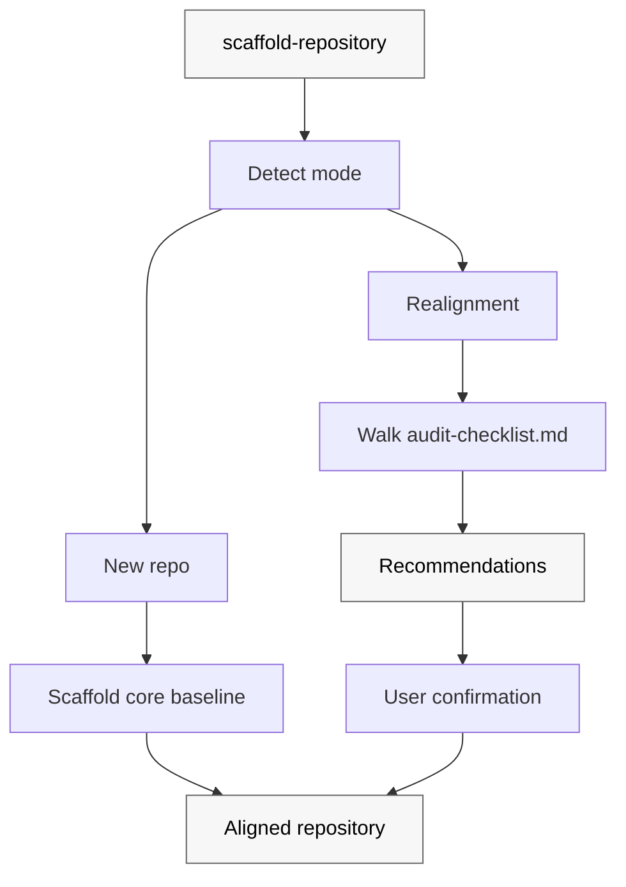

# scaffold-repository

Scaffold a new repository – or realign an existing one – to the Patina Project baseline. One invocation, consistent conventions, portable across every major AI coding tool.

`scaffold-repository` is distributed through the [`patinaproject/skills`](https://github.com/patinaproject/skills) marketplace. It ships a single skill that scaffolds a complete Patina Project baseline repository (commit + PR conventions, PNPM + Husky + markdownlint, agent docs, GitHub repo settings) and keeps existing repos aligned with the latest live baseline on rerun.

## How scaffold-repository works

`scaffold-repository` operates in one of two modes based on what it finds in the target repository.



## What scaffold-repository enforces

### Core baseline – every repo

- **Conventional Commits** with no scope and a required `#<issue>` tag; enforced locally by husky + commitlint and in CI by `pull-request.yml`.
- **PR title hygiene** – ASCII-only, conventional format, `#<issue>` subject, breaking-change marker consistency, `Closes #<issue>` in body.
- **Markdown linting** via `markdownlint-cli2`; husky `pre-commit` + `lint-staged` locally, `markdown.yml` in CI.
- **Workflow linting** via `actionlint` with `.github/actionlint.yaml`.
- **GitHub Actions SHA pinning** – every `uses:` references a full commit SHA with a version comment; policy documented in `AGENTS.md`.
- **PNPM toolchain** – `packageManager: pnpm@10.33.2`, `engines.node >=24`, `.nvmrc`, `.gitattributes`, `.editorconfig`.
- **Agent + repo docs** – `AGENTS.md`, `CLAUDE.md`, `CONTRIBUTING.md`, `SECURITY.md` (public only), `README.md`, `docs/file-structure.md`.
- **Claude Code project settings** – `.claude/settings.json` with no plugins enabled by default.
- **CODEOWNERS + issue/PR templates** under `.github/`.

### GitHub repository settings

`scaffold-repository` walks the target repo's merge settings (via `gh api`, `curl`, or visual inspection) and walks the user through the GitHub UI with a deep-link to bring them into alignment. Full matrix in [SKILL.md](./SKILL.md#github-repository-settings).

## Modes

- **New repo** – scaffold the full baseline, leave the first commit to the user.
- **Realignment** – walk the checklist, classify gaps as `missing`/`stale`/`divergent`, recommend changes grouped into ordered batches, never overwrite without explicit user confirmation.

## Supported AI coding tools

| Tool | Surface | Covered by |
|---|---|---|
| Claude Code | `.claude/settings.json`, `AGENTS.md` (`CLAUDE.md`) | Project settings + native |
| OpenAI Codex | `.codex/environments/environment.toml`, `AGENTS.md` | Workspace setup + native |
| Aider | `AGENTS.md` | Native |
| Zed | `AGENTS.md` | Native |
| Cline | `AGENTS.md` | Native |
| Opencode | `AGENTS.md` | Native |

## Install

Install just this skill via the [vercel-labs/skills](https://github.com/vercel-labs/skills) CLI:

```bash
npx skills@latest add patinaproject/skills --skill scaffold-repository
```

Or install the full `patinaproject-skills` plugin via your host's marketplace:

- Claude Code: `/plugin marketplace add patinaproject/skills` then `/plugin install patinaproject-skills@patinaproject-skills`
- Codex: `/marketplace add patinaproject/skills` then `/install patinaproject-skills`

See the [root README](../../README.md) for the full install guide.

## First use

After installing, run `scaffold-repository` from a cloned repository. The skill will prompt for:

- `<owner>`, `<repo>`, `<repo-description>`
- `<visibility>` – public or private

Author name, author email, and `SECURITY.md` contact default from `git config user.name` / `git config user.email`.

## Development

This repository is its own reference implementation. The live repository root is the baseline; there is no copied template tree under this skill. Running realignment mode against this repo must report zero gaps.

Local workflow:

```bash
pnpm install           # installs dev deps and wires husky
pnpm lint:md           # markdownlint-cli2
pnpm commitlint        # one-off commit-message validation
```

Commits and PR titles follow the enforced convention: `type: #<issue> short description`. See [`CONTRIBUTING.md`](./CONTRIBUTING.md) for the full rule; choose the commit type by product impact, not by file extension.

| Change | Type |
|--------|------|
| Adds or changes shipped behavior, including behavior expressed in Markdown skill files, workflow gates, prompt contracts, plugin metadata, marketplace behavior, generated agent instructions, or other user-visible configuration | `feat:` |
| Corrects broken shipped behavior in those same product surfaces | `fix:` |
| Explains the product without changing shipped behavior or release semantics | `docs:` |
| Performs maintenance that does not alter user-facing behavior | `chore:` |

Edits to `skills/**/SKILL.md` and adjacent skill workflow contracts are product/runtime changes by default, not documentation edits. Changes that should produce a release must not use non-bumping types such as `docs:` or `chore:`.

## Contributing

See [`CONTRIBUTING.md`](../../CONTRIBUTING.md) and [`AGENTS.md`](../../AGENTS.md). The release flow lives in [`docs/release-flow.md`](../../docs/release-flow.md).

## Related

- [`SKILL.md`](./SKILL.md) – skill contract, modes, placeholders, emitted tree.
- [`audit-checklist.md`](./audit-checklist.md) – realignment checklist.
- [`docs/file-structure.md`](../../docs/file-structure.md) – layout reference.
- [`patinaproject/skills`](https://github.com/patinaproject/skills) – marketplace distributing Patina Project plugins.
